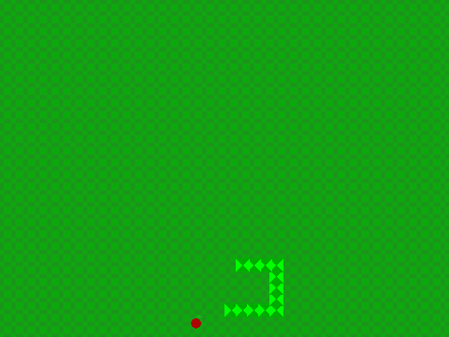

# Snake:
It just simple clone of popular game *Snake* writed completly in c++ using SFML and SDL2


# Requirements:
```SDL``` =< 2

```SFML``` =< 2.5

```cmake```=< 3.7

```g++```

```make```
# Before Building:
*Ubuntu*:
```
sudo apt-get install g++ cmake make libsfml-dev libsdl2-dev git
```
*Arch linux*:
```
sudo pacman -S sfml sdl2 gcc cmake make git
```
# Building:
You need to download source code:
```
git clone https://github.com/kubawis128/Snake.git
cd Snake
```
You can use CMake for this job:
```
mkdir build
cd build
cmake ..
make
```
If you get error it may mean that you have not meet requirements:

Repeat step: **Before Building**

# Run:
*Linux*:
```
  ./Snake
```
*Windows*:

Double click ```Snake.exe```
# Resources
If you want to change resources(textures,fonts) you can use linux tool: *xxd*

**Usage**:
```
xxd -i [your_file] [Name_of_resource]
```
**Name of resources:**

body.hpp -> Texture of snake body

font.hpp -> Menu font

icon_menu.hpp -> Menu icon

icon.hpp -> Game icon

tile.hpp -> Game tile(background)

food.hpp -> Food (cherry)
